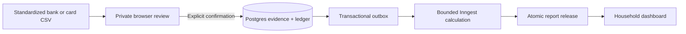

# networth

**A private, self-hosted household finance tracker built around reviewed CSV imports.**

Import standardized bank and credit-card transactions, check every row, classify income and expenses,
and publish a consistent household dashboard. Financial records are written only after
explicit confirmation. Money calculations use exact decimals from CSV through reports.

[](https://nodejs.org/)
[](https://nextjs.org/)
[](LICENSE)

> [!IMPORTANT]
> Bank and credit-card imports, categories, reconciliation, trends, cash flow, account
> balances, liabilities, shared credit facilities, and activity drilldowns work.
> Investments, SGBs, loans, portfolio performance, automatic statement parsing, and bank
> connections are separate future contracts. The current milestone includes encrypted local backup and
> isolated restore; complete a restore drill before storing irreplaceable records.

## What it does

- Keeps registration closed: the installer creates the first owner, then owners invite
  household members as viewers or editors.
- Accepts versioned `bank-v1` and `card-v1` CSV files instead of raw statements.
- Lets an editor review statement coverage, account assignment, categories, transfers,
  possible duplicates, and reconciliation evidence before confirmation.
- Classifies income and expenses into defined categories such as Grocery, Fees & charges,
  Entertainment, Salary, and Uncategorized.
- Commits source evidence, a balanced ledger, and durable workflow intent atomically.
- Recalculates bounded pages through Inngest and publishes a complete report release.
- Shows net worth from reconciled INR bank/cash balances and evidenced card liabilities,
  monthly income and expenses, cash flow, shared-limit utilization, account details, and source-linked activity.
- Preserves unknown or incomplete data instead of inventing balances, FX values, cost
  basis, historical flows, or returns.



## Current scope

| Area | Available now | Planned |
| --- | --- | --- |
| Access | Owner bootstrap, invites, roles, recovery codes, revocable sessions | External identity providers |
| Import | Reviewed `bank-v1` and `card-v1` CSV, exact retry detection, duplicate warnings | Raw statement parsing and bank integrations |
| Classification | Defined income/expense categories and Uncategorized | Automatic categorization rules |
| Accounts | Bank/cash accounts, INR cards and shared credit facilities, evidenced foreign-currency book values | Deposits, loans, investments, SGBs |
| Reports | Overview, accounts, liabilities, activity, 12-month trends, cash flow, reconciliation states | Portfolio allocation, returns and tax reports |
| Operations | Idempotent workflows, daily recovery cron, bounded provider capacity, encrypted local backup and restore | Automated hosted backup storage |

Transfers, card repayments, investment principal, and opening balances are intentionally
excluded from ordinary expenses. Statement balances are reconciliation evidence and are
never counted as additional assets.

## Deploy to Vercel

Use your own [Vercel Hobby](https://vercel.com/docs/plans/hobby),
[Neon Free](https://neon.com/pricing), and
[Inngest Hobby](https://www.inngest.com/pricing) accounts. The target is ₹0 recurring
hosting for personal use. Stay on free plans and check their current allowances before
enabling imports; the app never purchases capacity. Use the included `vercel.app`
address—no domain purchase is needed.

The guided path below creates the database roles and secrets for you. You need Git,
Node.js 24, npm 12.2 or newer within npm 12, and a trusted computer for administration.
Docker, `psql`, and manual SQL are not needed for this path. The commands assume a
Bash-compatible terminal; `nvm` commands require [nvm](https://github.com/nvm-sh/nvm)
to be installed. If you already have a compatible Node/npm pair, skip those commands.

### 1. Get the app

Fork this repository on GitHub, then clone your fork:

```bash
git clone https://github.com/YOUR_GITHUB_USER/networth.git
cd networth
nvm install
nvm use
npm install --global npm@12.2.0
npm ci
```

### 2. Prepare your database

Create a Neon Free project. In its connection dialog, select the database owner,
turn connection pooling **off**, and copy the connection URL.

Choose a Vercel project name, then run:

```bash
npm run deploy:prepare
```

Paste the Neon URL at the hidden prompt, then enter your intended production address,
such as `https://my-networth.vercel.app`. The command prepares the schema, creates
restricted app and worker logins, generates secrets, and saves them in
`.env.deploy.local`. Keep this Git-ignored file private; you will use it for future
administration. Do not run preparation again for ordinary updates.

### 3. Deploy the website

In Vercel, choose **Add New → Project** and import your fork.

- Use the **Next.js** framework preset and **Node.js 24.x**.
  See [Vercel's supported Node versions](https://vercel.com/docs/functions/runtimes/node-js/node-js-versions).
- Set the install command to `npm install --global npm@12.2.0 && npm ci`,
  and the build command to `npm run build`.
- Open `.env.deploy.local` in your editor. Add its seven non-empty variables to
  Vercel's **Production** environment only. When entering a value manually, omit the
  surrounding quotes. Leave the three blank `INNGEST_…` entries out.
- Deploy. Check the assigned production domain: if it differs from your chosen address,
  update `APP_URL` in both Vercel and `.env.deploy.local`, then redeploy.

Do not add local-development flags or test database credentials to Vercel.
Environment changes take effect after a redeploy.

### 4. Create your owner account and connect Inngest

Open `https://YOUR_APP/setup`. Enter the `BOOTSTRAP_SECRET` from your private file,
create your owner account, and save all eight recovery codes. Sign in.

Follow [Inngest's Vercel integration instructions](https://www.inngest.com/docs/durable-execution/deploying-functions/platforms/vercel)
to connect this project. Ensure Production receives `INNGEST_EVENT_KEY` and
`INNGEST_SIGNING_KEY`, then redeploy. In Inngest, check that the app and its functions
are registered at `https://YOUR_APP/api/inngest`. A successful endpoint response alone
does not prove that registration or delivery works.

### 5. Enable imports

Check usage in all three provider dashboards, including other projects on the same
accounts. If usage is below 80% and the allowance below fits the remaining capacity,
run on your administration computer:

```bash
npm run deploy:enable -- personal
npm run deploy:check
```

The personal allowance lasts **24 hours** and caps work at **10 imports, 500 calculation
attempts, and 100 MB of derived storage**. It does not renew automatically.
`deploy:check` should report `PASS` for every check; `NEXT` means a setup or capacity
step remains. Neither command verifies your provider usage for you.

Remove `DATABASE_ADMIN_URL` and `BOOTSTRAP_SECRET` from **Vercel Production**, then
redeploy. Keep them in your private local file for administration and recovery.

### 6. Check an import and save a backup

Sign in and open **Import data → Bank account**. Create a new account named
“Synthetic test bank”. Save the following as a local CSV and upload it:

```csv
schema_version,row_id,transaction_ref,transaction_date,description,direction,amount,currency,event_type,category,book_amount_inr,fx_rate,related_row_id
bank-v1,test-1,TEST-001,2026-09-01,Synthetic groceries,debit,100.00,INR,expense,grocery,,,
```

Enter coverage **1–30 September 2026**, choose complete transactions, and enter
opening balance **1000** and closing balance **900**. Review and acknowledge any
displayed warnings, then confirm. Select **September 2026** in the dashboard and
check that the published report includes **₹100 Grocery expense**. Statement balances
alone may leave account valuation incomplete; the app will show the reason.

This saves real ledger records, so use a separate test installation if you want your
personal ledger to contain no synthetic entries. Also try an invitation from Settings
and check the installation state at `/status`.

Create and verify an encrypted backup on your computer:

```bash
npm run backup:export:deploy -- backups/first-import
npm run backup:verify -- backups/first-import
```

The export asks for your owner password and a separate backup passphrase. Keep the
passphrase safe and follow the [restore drill](docs/backup-restore.md#restore-drill)
before relying on the app for personal records.

### When you next import

If confirmation is paused because the 24-hour allowance expired, review provider usage
again and rerun `npm run deploy:enable -- personal`. You can read existing reports
without renewing the allowance while the underlying services remain available.
The `regular` preset allows 30 imports, 1,500 attempts, and 200 MB for 24 hours;
use it only when that capacity is available.

For custom roles, smaller budgets, or recovery from a failed preparation, see the
[manual deployment guide](docs/deployment-manual.md). Guided setup already prepares
the worker; you do not need to run the manual worker commands as well.

## Updating an installation

Pull reviewed changes on the trusted checkout and install exactly the locked packages:

```bash
git pull --ff-only
nvm use
npm install --global npm@12.2.0
npm ci
```

Back up the database, restore that backup into a separate database, and test it before
upgrading. Keep the hosted credentials in `.env.deploy.local` on the trusted computer, then run:

```bash
node --env-file=.env.deploy.local --conditions=react-server --import tsx scripts/admin.ts migrate
```

This explicitly loads the hosted configuration; plain `npm run db:migrate` uses
`.env.local` instead. This command upgrades an existing completed installation. Fresh installations use
`/setup` instead. No build, startup, or ordinary request applies migrations. After a
successful migration, deploy the matching application revision and repeat the hosted
verification. Never edit an already-applied migration.

The application backup commands are:

```bash
npm run backup:export -- backups/DATE
npm run backup:verify -- backups/DATE
npm run backup:restore -- backups/DATE  # empty target database only
```

For a hosted database, use `backup:export:deploy` or `backup:restore:deploy`; these commands
load the private `.env.deploy.local` file explicitly.

See [encrypted local backup and restore](docs/backup-restore.md) for credential handling,
retention, deletion and post-restore report regeneration.

## Local development

Requirements: Node 24.21 (see `.nvmrc`), npm 12.2, and Postgres 16 or newer. Node 26
is also supported for local development. Docker Compose is an optional local Postgres
convenience; Docker is not required in production.

```bash
nvm use
npm install --global npm@12.2.0
npm ci
npm run local:setup
npm run db:up
npm run local:auth
npm run dev
```

Open [http://127.0.0.1:3000](http://127.0.0.1:3000). In a second terminal, start the
local Inngest Dev Server:

```bash
npm run inngest:dev
```

`local:setup` creates a private, Git-ignored `.env.local` with random development
secrets and loopback database URLs. `db:up` starts only Postgres on loopback port 15432.
Run `npm run db:stop` to stop it without deleting its volume. If you already run
Postgres 16+, configure the three local roles yourself and skip Docker.

For a synthetic, read-only interface preview:

```bash
LOCAL_UI_PREVIEW=1 npm run dev
```

Then open [http://127.0.0.1:3000/preview](http://127.0.0.1:3000/preview). The preview is
disabled on Vercel and accepts no uploads.

## CSV format and categories

Download these synthetic public files from a running installation or the repository:

- [blank bank template](public/templates/bank-v1.csv);
- [example bank transactions](public/templates/bank-v1-example.csv);
- [matching statement metadata](public/templates/bank-v1-example-manifest.json);
- [foreign-currency example](public/templates/bank-v1-fx-example.csv);
- [defined category codes](public/templates/categories-v1.csv).

The exact header is:

```csv
schema_version,row_id,transaction_ref,transaction_date,description,direction,amount,currency,event_type,category,book_amount_inr,fx_rate,related_row_id
```

Use a category **code** from `categories-v1.csv`, such as `grocery`, `fees`,
`entertainment`, or `salary`. A blank category remains Uncategorized. Unknown codes and
income/expense mismatches are rejected. The import screen also supports individual and
bulk category assignment during review.

`bank-v1` represents cash movement in a bank account. It does not pretend that a net
bank debit contains enough detail to model a card purchase, security trade, SGB holding,
loan split, corporate action, or tax lot. Those products require their own evidence and
templates. See [the complete bank CSV contract](docs/bank-csv-v1.md) and
[the reviewed import workflow](docs/bank-imports.md).

## Verification

Stop the development server before running the full checks:

```bash
npm run check
npm run test:integration
npx playwright install chromium
npm run test:e2e
npm run test:e2e:auth
node scripts/check-client-secrets.mjs
```

`npm run check` runs lint, generated-route type checking, unit tests, and a production
build. Integration and authenticated browser tests require the local disposable
`networth_test` database and recreate its `core` schema. Never point their
`TEST_DATABASE_URL` at real records. See [authentication operations](docs/authentication.md),
[workflow delivery](docs/workflow-delivery.md), and
[report publication](docs/report-publication.md) for deeper operational checks.

## Troubleshooting

**`Administration failed. Verify configuration...`**

The administrative commands deliberately hide database details. Check that the file
loaded by your command (`.env.deploy.local` for guided hosted commands, `.env.local`
for ordinary local commands) contains the direct `DATABASE_ADMIN_URL`, the database is reachable, TLS verification is
enabled when hosted, and `/setup` has completed. `npm run db:migrate` is for an existing
installation; use `/setup` for a new one.

**Readiness returns `503`.**

The public `/api/health/ready` route currently always returns `503`: its workflow
verification flag is not wired. Use `npm run deploy:check`, the authenticated `/status`
screen, and a successful import-to-report run instead. `/api/health` checks liveness only.

**`deploy:prepare` fails or says configuration already exists.**

Keep the existing `.env.deploy.local`; do not regenerate it to update the app. For a
failed preparation, check the direct Neon owner URL and role permissions. Only use
`npm run deploy:prepare -- --rotate` when intentionally replacing existing restricted
role passwords and no private configuration file exists; existing deployments will need
the replacement credentials. See the [manual guide](docs/deployment-manual.md).

**Login or setup does not work on a preview URL.**

That is deliberate. Use the exact Production `APP_URL`; preview deployments cannot access
authentication, database, import, or workflow operations.

**A changed environment variable has no effect.**

Redeploy the Vercel project. Variable changes apply to new deployments, not an already
running deployment.

**A confirmed import is waiting.**

Inspect Inngest delivery and function runs, the worker connection, the capacity lease,
and provider usage. Retry or resume through the authenticated owner controls. Do not
modify confirmed ledger rows directly.

## Security and privacy

- No hosted AI, analytics, raw-statement parser, bank integration, or automatic upgrade.
- No credentials, provider tokens, real financial fixtures, or raw import payloads in Git.
- Household membership is checked on every protected server operation; Postgres RLS is a
  second isolation boundary.
- Confirmed ledger events are append-only and balanced. Corrections use traceable reversal
  and replacement events.
- API money values are decimal strings. Authoritative arithmetic never uses JavaScript
  floating point.
- Provider capacity is reviewed and leased explicitly. Insufficient capacity pauses work
  instead of deleting financial history or silently exceeding a free-plan target.

Read [the architecture boundaries](docs/architecture.md),
[live-report behavior](docs/live-bank-reports.md), and [project instructions](AGENTS.md)
before making structural changes.

## License

[MIT](LICENSE)
